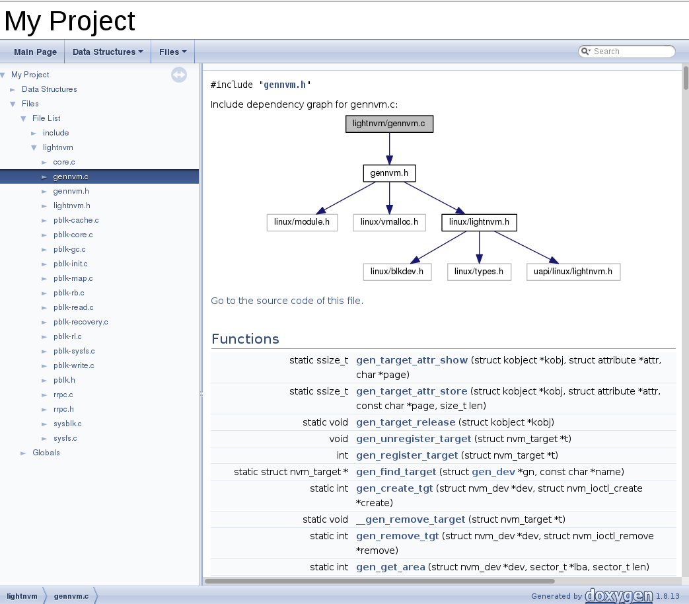
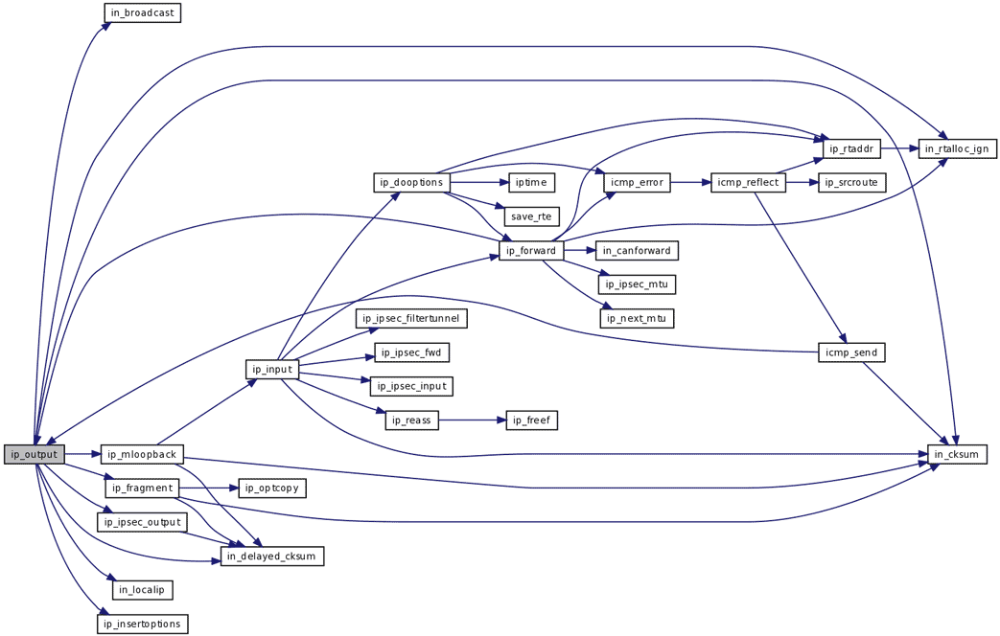

# Docygen
### Getting started
Doxygen là một công cụ mạnh dùng để sinh tài liệu từ những chú thích trong các file code, với những người lười làm doc thì doxygen đã giải quyết vấn đề document cho các developer và người quản trị dự án nói riêng một cách tuyệt vời

### Đặc điểm của Doxygen
Tự động xuất document dưới dạng HTML hoặc LaTex
Các format như Hyperlink PDF, HTML dặng nén, Unix man cũng support
Xuất cả document cho những code không có comment hơặc comment không theo rule nhất định
Xuất cả Relation fig,Include fig, Derived fig, Colaboration fig(nếu sử dụng graphvis）
Chạy trên Unix, Linux, Mac OSX, Windows
### Running doxygen
chay code tren terminal nhu sau

$ sudo apt-get install doxygen

$ doxygen -g name

$ doxygen name

  Searching for include files...
====>> mo file config len de tuy chinh

====>> sau do mo file index.html trong thu muc html

### Use Graphvis
$sudo apt-get install graphviz
khi chay ta se duojc ket qua nhu sau

